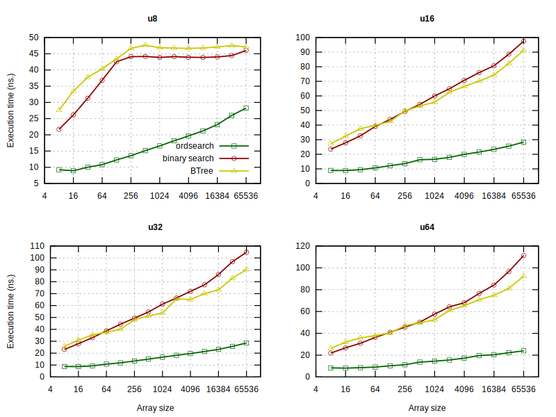

# ordsearch

[](https://crates.io/crates/ordsearch)
[](https://docs.rs/ordsearch/)
[](https://travis-ci.org/jonhoo/ordsearch)

This crate provides a data structure for approximate lookups in ordered collections.

More concretely, given a set `A` of `n` values, and a query value `x`, this library provides an
efficient mechanism for finding the smallest value in `A` that is greater than or equal to `x`.
In particular, this library caters to the important case where there are many such queries to
the same array, `A`.

This library is constructed from the best solution identified in [Array Layouts for
Comparison-Based Searching](https://arxiv.org/abs/1509.05053) by Paul-Virak Khuong and Pat
Morin. For more information, see the paper, [their
website](http://cglab.ca/~morin/misc/arraylayout-v2/), and the [C++ implementation
repository](https://github.com/patmorin/arraylayout).

## Current implementation

At the time of writing, this implementation uses a branch-free search over an
Eytzinger-arranged array with masked prefetching based on the [C++
implementation](https://github.com/patmorin/arraylayout/blob/3f20174a2a0ab52c6f37f2ea87d087307f19b5ee/src/eytzinger_array.h#L253)
written by the authors of the aforementioned paper. This is the recommended algorithm from the
paper, and what the authors suggested in
https://github.com/patmorin/arraylayout/issues/3#issuecomment-338472755.

Note that prefetching is *only* enabled with the (non-default) `nightly` feature due to
https://github.com/aweinstock314/prefetch/issues/1. Suggestions for workarounds welcome.

## Performance

The included benchmarks can be run with

```console,ignore
$ cargo +nightly bench --features nightly
```

This will benchmark both construction and search with different number of values, and
differently sized values -- look for the line that aligns closest with your data. The general
trend is that `ordsearch` is faster when `n` is smaller and `T` is larger as long as you
compile with
[`target-cpu=native`](https://github.com/jonhoo/ordsearch/issues/2#issuecomment-390441137) and
[`lto=thin`](https://github.com/jonhoo/ordsearch/issues/2#issuecomment-390446671). The
performance gain seems to be best on Intel processors, and is smaller since the (relatively)
recent improvement to [SliceExt::binary_search
performance](https://github.com/rust-lang/rust/pull/45333).

Below are summarized results from an Intel(R) Core(TM) i7-1068NG7 CPU @ 2.30GHz CPU run with:

```console
$ rustc +nightly --version
rustc 1.75.0-nightly (e0d7ed1f4 2023-10-01)
$ env CARGO_INCREMENTAL=0 RUSTFLAGS='-C target-cpu=native' cargo +nightly bench --features nightly
```



## Future work

 - [ ] Implement aligned operation: https://github.com/patmorin/arraylayout/blob/3f20174a2a0ab52c6f37f2ea87d087307f19b5ee/src/eytzinger_array.h#L204
 - [ ] Implement deep prefetching for large `T`: https://github.com/patmorin/arraylayout/blob/3f20174a2a0ab52c6f37f2ea87d087307f19b5ee/src/eytzinger_array.h#L128
